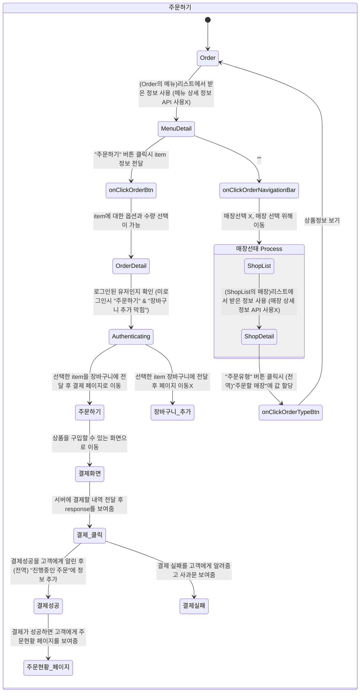

# 프론트 흐름

## 개요 및 목적

이 문서는 프로젝트의 프론트엔드 비즈니스 흐름을 정의하고, 팀원들이 쉽게 이해 할 수 있도록 만들었습니다.

## 1. 화면 이동 flow

### 1.1. 주문

사용자가 주문시 보여질 흐름도

**상태 흐름:**

```mermaid
stateDiagram-v2
    direction LR
      state "주문하기" as AppFlow {
    [*] --> Order
    Order --> MenuDetail: (Order의 메뉴)리스트에서 받은 정보 사용 (메뉴 상세 정보 API 사용X)
    MenuDetail -->  onClickOrderBtn: "주문하기" 버튼 클릭시 item 정보 전달
    MenuDetail --> onClickOrderNavigationBar:""
    onClickOrderNavigationBar --> StoreSelectionProcess: 매장선택 X, 매장 선택 위해 이동
    state "매장선태 Process" as StoreSelectionProcess {
        %% MenuDetail --> onClickOrderBtn: 매장 선택을 안 했을시 ShopList로 이동

        ShopList --> ShopDetail: (ShopList의 매장)리스트에서 받은 정보 사용 (매장 상세 정보 API 사용X)
        %% ShopDetail --> onClickOrderTypeBtn: "주문유형" 버튼 클릭시 (전역)"주문할 매장"에 값 할당
         ShopDetail --> onClickOrderTypeBtn: "주문유형" 버튼 클릭시 (전역)"주문할 매장"에 값 할당

        }
        onClickOrderTypeBtn --> Order: 상품정보 보기


    onClickOrderBtn --> OrderDetail: item에 대한 옵션과 수량 선택이 가능
    OrderDetail -->Authenticating: 로그인된 유저인지 확인 (미로그인시 "주문하기" & "장바구니 추가 막힘")


    Authenticating --> 주문하기: 선택한 item을 장바구니에 전달 후 결제 페이지로 이동
    Authenticating --> 장바구니_추가: 선택한 item 장바구니에 전달 후 페이지 이동X
    주문하기 --> 결제화면: 상품을 구입할 수 있는 화면으로 이동
    결제화면 --> 결제_클릭: 서버에 결제할 내역 전달 후 response를 보여줌
    결제_클릭 --> 결제성공: 결제성공을 고객에게 알린 후 (전역) "진행중인 주문"에 정보 추가
    결제_클릭 --> 결제실패: 결제 실패를 고객에게 알려줌고 사과문 보여줌
    결제성공 --> 주문현황_페이지: 결제가 성공하면 고객에게 주문현황 페이지를 보여줌
}

```
